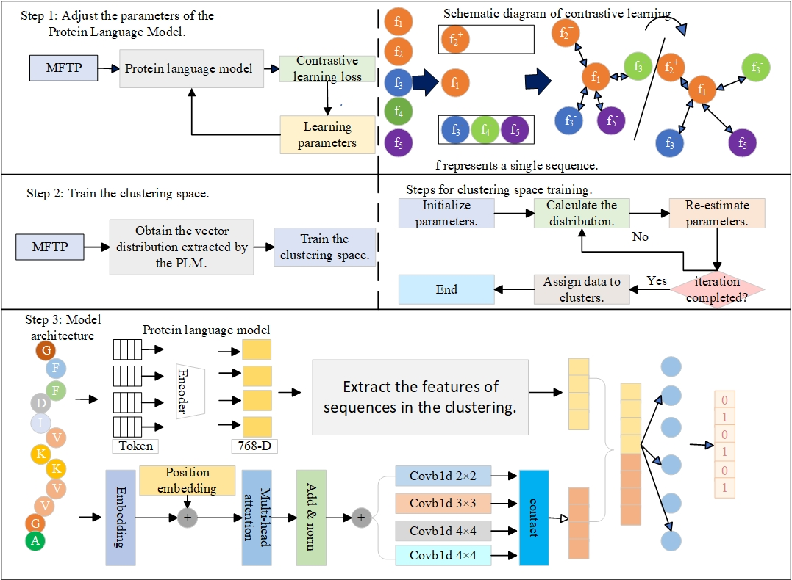

# PLMCCL-TP
PLMCCL-TP: The Protein Language Model and Clustering Method Based on Contrastive Learning Applied to the Multifunctional Therapeutic Peptide Identification Model

## Introduction

In this paper, we developed a model named PLMCCL - TP for predicting multifunctional therapeutic peptides (MFPTs). Compared with existing methods, this work has the following advantages:
(1)Make full use of the protein language model to extract protein sequence information.
(2)Utilize contrastive learning to enhance the distinguishability among different peptides.
(3)Employ the Gaussian Mixture Model (GMM) clustering method to better extract the information of related peptides.
(4)Use multi-scale convolution to extract sequence information from different distances.

The framework of the PLMCCL-TP method for MFTP prediction is described as follows:

## Training and test PLMCCL-TP model
python main.py

## Installation 
Address for obtaining protein language models:https://huggingface.co/Rostlab/prot_t5_xl_uniref50

## Contact
Please feel free to contact us if you need any help.

